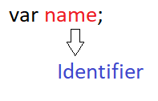

# JavaScript
---

### Introduction:

+ JavaScript is one of the most popular programming language in the world
+ JavaScript was Invented by **Brendan Eich** in 1995 during has time at **Netscape Communication**
+ It was inspired by Java, scheme & self
+ It's first name is Netscape's Mocha. It's not much more popular. At that time Java is most popular programming language
+ He desided to change the language name Mocha to JavaScript
+ Netscape submitted JavaScript to International Standard Company ECMA. Then JS changed to ECMAScript
+ The starting point for a standard specification that all browser vendors could conform the ECMAScript in 1997 
+ It provides client side scripting on the webpages
+ It is used to design web pages with high sceurity
+ Many Desktops & server side programs are used JavaScript


#### Variable:

+ Variable is used to storing the data values
    + Ex: ```var x=10
    `var y="APSSDC" or 'APSSDC'```
+ JavaScript no print predifined functions available. If we print anything we can use ```console.log(<variable name>)```

**JavaScript Identifiers :**

+ All JavaScript variables must be identied with Unique names(Identifiers)



+ General Rules for constructiong variable names are:
    + Names can contains Letters, Digits, Underscore, Doller symbols
    + Name must begin with letters, Unsderscore & Doller symbol
    + Variable names are case sensitive
    
+ datatypes are majorly two types of languages
    + Statically(c,c++, Java)
    ```JavaScript
    int x=1
    
    str y="rajesh"
    ```
    + Dynamically(JS, Python, Ruby etc.,)
    ```JavaScript
    var x=1
    
    var y="rajesh"
    ```
    + Datatypes are basically type of data that can be used and manipulated in program
    + The latest ES6 has 7 data types. In those 7 data types 6 data types are premitive(predifined). i.e.,
      + **Numbers** : 1,2,3 etc.,
      + **String** : "Hello Apssdc"
      + **Boolean** : It represents a lodocal entity and have two values **True, False**
      + **Null** : This typs has only one value
      + **Undefined** : A variable has not been assigned value is Undifined
      + **Object** : It has most important data type and forms the bulding blocks for moders JS. we'll learn about this in future concepts
   
    

#### Arrays:

+ In general Array is a collection of logical related elements
+ JavaSctipt array is a special variable. It is used to store the multiple values at a time in a single variable
+ Arrays are list-like **objects** whose prototype has methods to perform traversal and mutation operations
+ Arrays are special type of Objects. ```typeof``` operator in JS returns **Object** for arrays 
+ If you can access the values of an array by refers to an index number/value. Index value must be started from **0**
+ Neither the length of a JavaScript array nor the types of its elements are fixed
+ An array's length can change at any time, and data can be stored at non-contiguous locations in the array

```Ex: var a=['apssdc','ravi','rajesh']```

**How to find the leagth,sorting of array in JS?**

```console.log(<variable name>.lenght)
Ex:
console.log(a.lenght)    //3 
**length** is used to return the no of elements available in array
console.log(a.sort()) // ['apssdc','rajesh','ravi']
**sort()** is used to sorting the arrys values
console.log(a[0])    //apssdc
console.log(typeof(a))  //Object
```
+ If we can access all array values at a time use *for loop*

```for (i in a){
console.log(a[i])
}
```

#### Conditional Statements:

+ The conditional statements include in the JS code assist with decision. Based on certain conditions. The conditional Statements are several types they are:
    + if
    + else
    + else if
    + switch
    
+ **if**:  It executes a specified code segment if the given condition is ``True``
    + *Syntax*:
      
        ```javascript
        If(condition){
        //code execution
        }
        ```
        
+ *Example*:
```var age=25;
if(age=>25){
console.log("valid");
}
```
        
+ **Else**:When the condition inside the if statement is false, the code associated with the else statement gets executed

    + *Syntax*:
    
    ```javascript
    if (condition){
    //code to get executed when the condition is true
    }
    else{
    //code to get executed when the 'if' condition fails
    }
    ```
    
+ *Example*:
```var age=25;
if(age<25){
console.log("valid");
}
else{
console.log("not valid");
}
```
+ **Else if**: When the first condition fails, the else-if allows the program to specify some new condition(s).

    + *Syntax*:
    ```javascript
    if (condition_one){
    //code to execute if condition_one is true
    }
    else if (condition_two){
    //code to execute if the condition_one fails but the condition_two is true
    }
    else{
    //code to execute if the condition_one is false
    }
    ```
+ *Example*:
```if (marks > 90 && marks <= 100){
grade = 'A+';
}
elas if (marks > 80 && marks <= 90){
grade = 'A';
}
else if (marks > 70 && marks <= 80){
grade= 'B';
}
else{
grade='fail';
}
```

+ **Switch**:The switch case statement has an expression which is compared with values of each case statement and if a match is found, the associated code is executed.

    + *Syntax*:
    ```javascript
    switch(expression){
    case a:
    //block of code
    break;
    case b:
    //block of code
    break;
    ```
    
#### Looping Statments:

+ Loops are used to execute the same block of code again and again, as long as a certain condition is met
+ Loop is used to automate the repetitive tasks within a program to save the time and effort
+ JavaScript now supports five different types of loops:
    + while
    + do while
    + for
    + for ..in
    + for ..of
    
+ **while**: The while loop, loops through a block of code as long as the specified condition evaluates to true. As soon as the condition fails, the loop is stopped
    + *syntax*:
    ```javascript
    while(condition) {
    // Code to be executed
    }
    ```
+ *Example*:
```var a=1
while(a<=10){
console.log(a);
a++;
}
``` 

+ **do while**:The do-while loop is a variant of the while loop, which evaluates the condition at the end of each loop iteration. With a do-while loop the block of code executed once, and then the condition is evaluated, if the condition is true, the statement is repeated as long as the specified condition evaluated to is true. 

    + *syntax*:
    ```javascript
    do {
    // Code to be executed
    }
    while(condition);
    ```
+ *Example*:
```var a=1
do{
console.log(a);
a++;
}
while(a<=10);
``` 

**What is the difference b/w while & do-while?**

+ The **while** loop differs from the **do-while** loop in one important way — with a **while** loop, the condition to be evaluated is tested at the beginning of each loop iteration, so if the conditional expression evaluates to false, the loop will never be executed

+ With a **do-while** loop, on the other hand, the loop will always be executed once even if the conditional expression evaluates to false, because unlike the **while** loop, the condition is evaluated at the end of the loop iteration rather than the beginning

+ **for**:The for loop repeats a block of code as long as a certain condition is met. It is typically used to execute a block of code for certain number of times. Its syntax is:

    + *syntax*:
    ```javascript
    for(initialization; condition; increment) {
    // Code to be executed
    }
    ```

+ *Example*:
```for(var i=1; i<=5; i++) {
    console.log("Iteration "+i);
}
```
+ **for ..in**:loops through the properties of an object or the elements of an array.

    + *syntax*:
    ```javascript
    for(variable in object) {
    // Code to be executed
    }
    ```
+ *Example*:
```var data=['apssdc','apssdc1','apssdc2','apssdc3']
for (i in data){
console.log(data[i]);
}
```
+ **for ..of**:ES6 introduces a new **for ..of** loops over iterable objects such as arrays, strings, etc., Also, the code inside the loop is executed for each element of the iterable object

    + *syntax*:
    ```javascript
    for(variable of object) {
    // Code to be executed
    }
    ```
+ *Example*:
```var a="APSSDC Welcome's you"
for (i of a){
console.log(i);  //A,P,S,S,D,C, ,W,e,l,c,o,m,e,',s, ,y,o,u
}
```

## DOM (Document Object Model):

+ The Document Object Model, or DOM for short, is a platform and language independent model to represent the HTML or XML documents
+ It defines the logical structure of the documents and the way in which they can be accessed and manipulated by an application program
+ In the DOM, all parts of the document, such as elements, attributes, text, etc. are organized in a hierarchical tree-like structure; similar to a family tree in real life that consists of parents and children
+ DOM Tree depends on HTML

+ *Example*:


+ The above diagram demonstrates the parent and chaild relationship between the nodes
+ ``<head>`` abd ``<body>`` elements are teh child nodes of ``<html>``.It's a parent node
+ The ``<head>`` and ``<body>`` elements are also siblings since they are at the same level 
+ The text content inside an element is a child node of the parent element. For example, *``Mobile OS``* is considered as a child node of the ``<h1>``
+ HTML attributes such as ``id, class, title, style, etc``. are also considered as nodes in DOM hierarchy but they don't participate in parent/child relationships like the other nodes do
+ Each element in an HTML document such as image, hyperlink, form, button, heading, paragraph, etc. is represented using a JavaScript object in the DOM hierarchy
+ Each object contains properties and methods to describe and manipulate these objects

**How to call JavaScript into html page?**

+ use ``<script>`` tag in html
+ If you are using internal script in the same html file use like this
```<script><write your code here></script>```
+ If you are using external script to get into html use like this
```<script src="<external file name> ex: main.js"></script>```

#### DOM Manipulations:

```<html>
<body id='root'><body>

<script>
    var root=document.getElementById('root');
    var h2=document.createElement("h2"); // creating h2 element
    h2.textContent="Rajesh APSSDC"; //add some text 
    root.appendChild(h2);
    </script>
```

+ The above example we are creating **heading 2**  tag with some text on that it's appen to the root *ID*

+ i want to add a class/id to the **h2** tag
```h2.classList.add("<classname>"); //add class name
h2.setAttribute("id/class","<id/class name>"); // add either class name or Id name
```
+ i want to apply some styles (like text color etc.,) to the h2 element

```javascript
h2.style.color='red';
```
+ i wnat creating one paragraph tag in html page and write some text in paragtaph tag using javascript as shown below

```html
<p id='p'></p>
```

```document.querySelector(".p").innerHTML="Hello APSSDC";```

**How many ways to get html tag/class/id names in JS?**
```javascript
document.getElementById(<idname>)
document.getElementByClassName(<classname>) 
document.getElementByTagName(<tag name>) 
document.querySelector("<.idname>/<.classname>/<tagname>")
document.querySelectorAll("<.idname>/<.classname>/<tagname>") //Its used for getting multiple id/class/tag with same name
```


## BOM(Browser Object Model):

+ The Browser Object Model (BOM) in JavaScript includes the properties and methods for JavaScript to interact with the web browser
+ BOM provides you with window object, for example, to show the width and height of the window. It also includes the window.screen object to show the width and height of the screen
+ JS BOM has types ```Window, Screen, Location, History, Dialogboxs, Timer```

```javascript
<script>
         document.write("Screen width: " + screen.width); //display the screen width
         document.write("<br>Screen width: " + screen.height);  //display the screen height
document.write("The URL of this page is: " + window.location.href); // it's used to find the eaxct page referance link
      </script>
      ```
+ `alert` is used for display some alert message like popup box
```alert("Hello apssdc")```

+ The prompt dialog box is used to prompt the user to enter information. A prompt dialog box includes a text input field, an OK and a Cancel button.

```prompt("What's your name?");```

+ A timer is a function that enables us to execute a function at a particular time
    + Using timers you can delay the execution of code so that it does not get done at the exact moment an event is triggered or the page is loaded. For example, you can use timers to change the advertisement banners on your website at regular intervals, or display a real-time clock, etc. There are two timer functions in JavaScript: ``setTimeout(function, milliseconds)`` and ``setInterval(function, milliseconds)``

+ if you are playing x game. When the game is over the page would be restart/refresh

```function gameover() {
    window.location.reload(true);
}
```

+ ```javascript
window.history.back(); // its used for get back to previos pagewindow.history.go(0); // its used to reload the current page
window.history.forward(); // its used to navigate for next page
```
+ If you attempt to access the page that does not exist in the window's history then the methods back(), forward() and go() will simply do nothing
